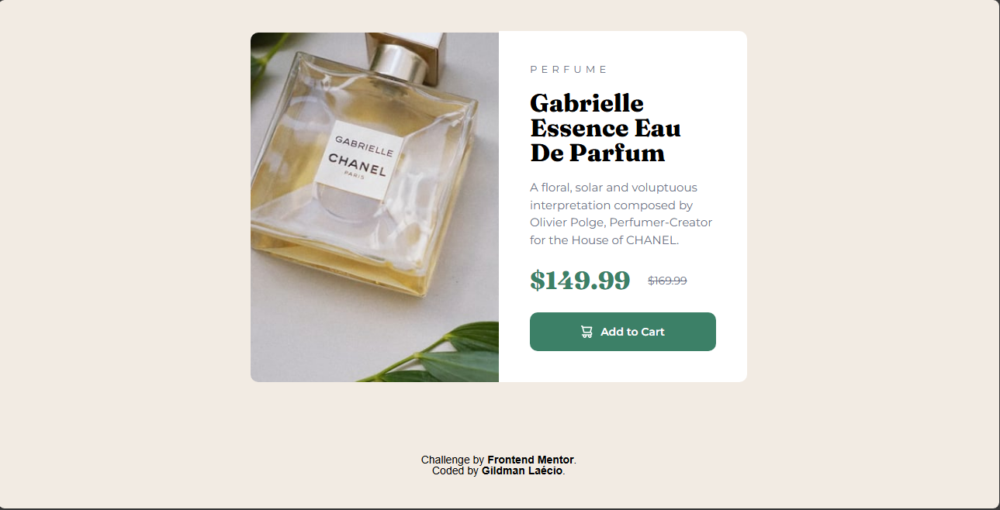

# product-preview-card-component-main

This is a solution to the [Product-preview-card-component-main challenge on Frontend Mentor](https://www.frontendmentor.io/learning-paths/building-responsive-layouts--z1qCXVqkD/steps/674c6af692fdd6803ca679dc/challenge/start). Frontend Mentor challenges help you improve your coding skills by building realistic projects. 

## Table of contents

- [Overview](#overview)
  - [Screenshot](#screenshot)
  - [Links](#links)
- [My process](#my-process)
  - [Built with](#built-with)
  - [What I learned](#what-i-learned)
  - [Continued development](#continued-development)
- [Author](#author)

## Overview

### Screenshot

These are my screenshots showing how the project turned out.

- For desktop version:



- For mobile version:


### Links

- Solution URL: [My Solution](https://gillaercio.github.io/product-preview-card-component-main/)

## My process

### Built with

- Semantic HTML5 markup
- CSS custom properties
- Flexbox
- Mobile-first workflow

### What I learned

I took advantage of this project to practice the use of **Flexbox**:

Smooth transition of sizes

```css
main {
  transition: width .4s, height .4s;
  transition-timing-function: ease;
}
```

### Continued development

I would like to improve the use of **Flexbox** in conjunction with media queries.

## Author

- Frontend Mentor - [@gillaercio](https://www.frontendmentor.io/profile/gillaercio)
- Github - [My Github](https://github.com/gillaercio)
- LinkedIn - [My LinkedIn](https://www.linkedin.com/in/gildman-la%C3%A9rcio/)


